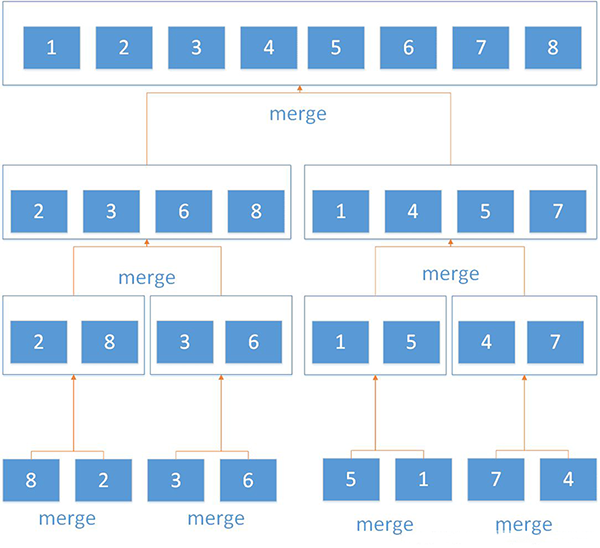

## 归并排序 ##
### 算法复杂度：O(nlogn)

将传入的数组进行不断的递归平分（直到分成每个数组中只有一个元素），每次比较分成左右两边的数组。



### 未改进的归并排序算法

```js
        //从小到大排序
        function sort(arr) {
        //调用递归函数开始排序
        __sort(arr,0,arr.length - 1);
        return arr

        //递归对arr[l,r]这个区间进行二分并排序
        function __sort(arr,l,r){
            
            //l>=r说明最多只有一个元素，则跳出递归
            if(l >= r)
                return

            const m = Math.floor((l+r)/2);

            //前一半数组 0,1
            __sort(arr,l,m);
            //后一半数组 0,1
            __sort(arr,m+1,r);

            //开始比较
            __merge(arr,l,m,r)

        }

        //对[l,r]这个区间进行排序。
        function __merge(arr,l,m,r){
            
            //i,j分别为数组左右两边需要比较的元素索引
            let i = l,j = m + 1;
            
            //拷贝一个临时的原数组
            let tempArr = [...arr];

            for(let k = l;k <= r;k ++){
                //左侧没元素了
                if(i > m){
                    arr[k] = tempArr[j];
                    j ++
                    continue
                }

                //右边没元素了
                if(j > r){
                    arr[k] = tempArr[i];
                    i ++
                    continue
                }

                if(tempArr[i] <= tempArr[j]){
                    arr[k] = tempArr[i];
                    i ++
                }else{
                    arr[k] = tempArr[j];
                    j ++
                }
            }
        }
    }
```