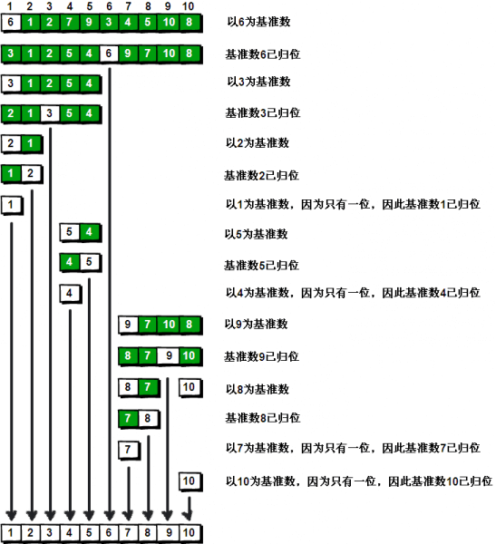

## 快速排序 ##
### 算法复杂度：O(nlogn)

速度比归并排序快。找到数首个元素合适的位置，根据这个位置进行将数组进行二分，递归执行上述的操作。



### 未改进的快速排序算法

```js
        //从小到大排序
        function quickSort(arr){

            return __quickSort([...arr],0,arr.length-1)
            
            function __quickSort(arr,l,r){
                if(l >= r) return

                const index = __getIndex(arr,l,r);

                // 通过确定好的元素，把数组分成两部分，递归进行同样的操作。
                __quickSort(arr,l,index-1);
                __quickSort(arr,index+1,r);

                return arr
            }
            
            // 确定数组中第一个元素的位置
            function __getIndex(arr,l,r){
                let index = l; //初始最合适的位置为l

                let v = arr[l]; //v为该区间的第一个元素
                
                // 通过for循环找到v的合适位置，并将数组中小于它元素放在左边，大于它的放在右边。
                for(let i=l+1;i<=r;i++){
                    // 当前元素小于v，则把它放在左边的区间最后一个位置，并且index要增加1
                    if(arr[i] < v){
                        [arr[i],arr[index + 1]] = [arr[index + 1],arr[i]];
                        index ++;
                    }
                }
                // 最后把v放到合适的位置上去
                [arr[l],arr[index]] = [arr[index],arr[l]];

                return  index
            }
             
        }
```